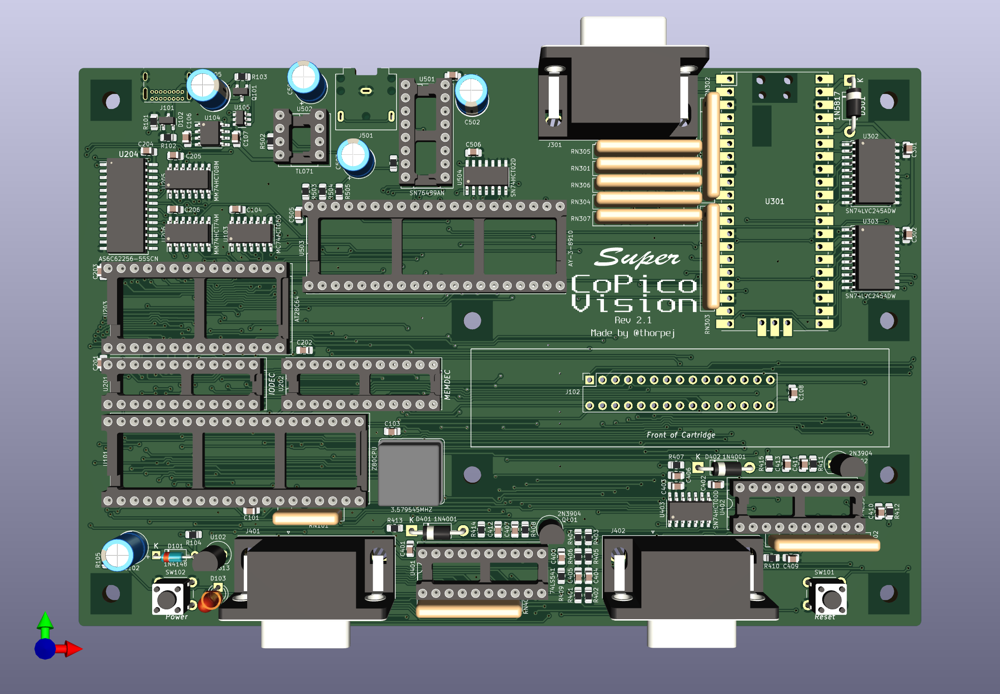

# CoPicoVision - A ColecoVision clone using a Raspberry Pi Pico with pico9918 for video
The CoPicoVision stems from yet another bout of nostalgia for a time before
photorealistic video games, when all we had was blocky tile graphics and a
few bleeps and bloops and gosh darn it, we liked it!  When I was a kid, I got
a ColecoVision one Christmas and I played the h*ll out of it.  Alas, I no
longer have it, but I wish I still did, and building a clone seems a lot more
fun than over-paying for one on eBay.

Ok, fine, I have a second motive: It also serves as a test mule for using
modified variants of Troy Schrapel's excellent
[pico9918](https://github.com/visrealm/pico9918) project, something I'm
considering using in other projects, and test mules that can play Mr. Do!
and Zaxxon (yes, yes, yes, and Donkey Kong) are the best kinds of test mules.

This work is licensed under the [Creative Commons Attribution
ShareAlike 4.0 International license](https://creativecommons.org/licenses/by-sa/4.0/).

## Project Status
### Update - Oct 11, 2024
Built up the controller section and played some Donkey Kong!  I did make
a mistake on the controller section, however.  Controller 1 and 2 are
swapped.  I will correct this in the next revision of the board, and will
figure out a bodge for the rev 0.1 boards that I've already run off.

There also a mistake in the physical placement of the card edge connector
for the cartridge.  It's a few millimeters too close to the front of the
board, and so the cartridge bumps into one of the 2N3904s in the controller
circuit and the cartridge doesn't quite align with the silk screen outline.
That's going to be a little tricker to fix because I might have to re-route
some of the board, but I'll fix that up as well.

Guess I should build the audio section next!

### Update - Oct 10, 2024
After replacing a bad oscillator, the first test board is working!  I have
not yet installed the audio or controller circuitry yet, but I can boot up
Donkey Kong and Buck Rogers, and, due to the lack of controller circuitry
being misinterpreted as input, game play starts!

### Update - Sept 24, 2024
Boards have been back for a while now, and I finally got around to starting
to build one up.  Thought I had all of the resistors I needed in my inventory,
but alas, I did not, so need to place a Jameco order!

### Update - Sept 2, 2024
I made some small adjustments to the PCB, and sent rev 0.1 off for
fabrication!

### Update - Sept 1, 2024
I made forks of pico9918 and vrEmuTms9918 in order to make the changes
needed for CoPicoVision, and then went ahead and made all of those
changes.  Initial firmware version checked in!

### Initial - Aug 31, 2024
The initial "rev 0.1" hardware design is done and ready to send off for
fabrication.  There is some software work to do on the pico9918 side of
things, but the changes I have in mind are trivial.  My plan is to wrap
my changes in proper configuration options and feed those changes back
to Troy.

So, yah, it's early!  Watch this space!

## Design philosophy
My goal is to play ColecoVision games, not to produce a faithful clone of the
circuit.  It needs to be fully-compatible with ColecoVision games, but that's
the extent of it.  As such, some shortcuts are going to be taken.

First of all, I'm using Troy Schrapel's excellent pico9918 engine for the video
display.  This reduces the number of vintage parts that need to be sourced, and
gives me VGA video output.  I won't be using the pico9918 as-is, however; since
I don't need all of the outputs of a real TMS9918A (no CPUCLK or GROMCLK), I'm
using a modified pico9918 firmware that doesn't bother with those outputs and
thus allows me to use a regular Raspberry Pi Pico as a module.

Second of all, I'm not going to bother with the expansion interface; I don't
particularly care about connecting an Adam module, and if I ever do, then it
will be time to re-evaluate my life choices.

And lastly, as should be obvious through my use of a microcontroller that's
hundreds of times more powerful than the ColecoVision itself, I have no qualms
about using programmable logic to reduce the part count and generally simplify
the design.  In particular, this means GAL22V10s for address decoding and other
glue logic rather than general-purpuse 7400-series parts.  Atmel still makes
a compatible part, and there are open source tools for programming them, so the
design is still very accessible.

There are two "vintage" parts that are required for the CoPicoVision:
* A 4MHz-capable Z80 CPU in a DIP-40 package.
* A TI SN76489AN sound chip.

Eventually, I'd like to replace the SN76489AN with an emulated part, (almost
certainly using a Pi Pico), but for now the real thing needs to be sourced.

Obviously, with the Z80 now being EOL'd, that poses a bit of a snag.  Luckily,
I have a stash of modern CMOS Z80s, and this design will also accept a vintage
NMOS Z80.  The CPU is clocked at 3.57MHz, so a Z80A or better is necessary.
Maybe one day I'll evaluate one of the FPGA Z80 cores floating around
to see if it's feasible to use one of those with an iCE40 FPGA in an updated
version of the CoPicoVision.  But for now, a genuine Z80 must be used.

## Design details
I spent some time mulling over how I wanted to approach this board.  I
considered doing an all-SMT board (except for the stuff that was only
available as through-hole), but I ultimately decided against it in order
to try and keep a more retro look.  I did, however, go with mostly all
SMT parts in the power supply since at least one of the parts I wanted to
use there was only available in SMT.  Ultimately, this proved necessary
in order to be able to squeeze everything onto the board (I wanted to have
at least a little clear board space for some silk screen markings).

The board is 4 layers: signals (and ground fill) top and bottom, along with
an internal ground plane and power plane.  I arrived at the size of the board
through experimentation; essentially, I did a rough layout of the board into
what I thought "looked pretty good", placed mounting holes and keep-outs, and
then drew an edge-cut box around it.  Once the box was drawn, I tried to stay
within that envelope.  I'm a total novice when I comes to PCB layout and
design, and I routed the entire board by hand, but did manage to make it fit.
Some signals are routed, ahem, interestingly, but this isn't a high-speed
design so it should be just fine.

The font of the board has power and reset buttons and the 2 controller
ports.  The rear of the board has power, audio, and VGA jacks, along with
the USB connector for the Raspberry Pi Pico in case there's a need to
update the pico9918 firmware.  There's a diode in between the Pico and
the rest of the board, so it's safe to update the firmware in situ.

I've included a bill of materials with Mouser part numbers for just about
everything; the jellybean SMT resistors / capacitors (in standard 0805 case)
and the jellybean carbon film THT resistors (BoM indicates the footprint
constraints) are left as an exercise for the reader.  Same goes for chip
sockets.

### Power supply
The power supply is fairly simple, since we don't need the -12V rail that's
found on the original ColecoVision.  We do, however, require a -5V rail, which
is used as a bias voltage in the controller interface circuit.

Power comes in via a USB-C connector (with ESD protection diodes on the
control channel signals).  Power is switched using a MAX16054 on/off
supervisor chip that controls a high-side P-FET to supply power to the
rest of the system.  The MAX16054 is controlled using a single momentary
pushbutton.

The -5V rail is generated using an ICL7660A charge pump chip.

### Clock and reset generation
The clock circuit on the CoPicoVision is as simple as it gets: it's simply
a 3.579545 MHz DIP-8 oscillator can that drives the whole thing.  The only
devices that need the CPUCLK signal are the Z80, the M1 wait-state generator,
and the SN76489AN sound chip, and those are all directly driven from the
oscillator.  The Pi Pico that generates the video has its own clock, so none
of the complicated clock circuitry from the original ColecoVision is necessary.

The reset circuit is also very simple.  It's based on the DS1813 reset
generator IC, which also de-bounces the reset button.  There is a small RC
network that makes the power-on-reset slightly longer than a manual reset.

### Address decoding and memory
Address decoding is performed using 2 GAL22V10 programmable logic devices.
The ColecoVision uses 2 74LS138s for address decoding, but also requires
some extra logic to invert some of the signals used by the decoders.  By
using GALs for this purpose, I save the extra logic chips.

The ColecoVision also uses a 74LS74 along with some additional logic gates
to add a wait-state when the Z80 performs an opcode fetch.  It does this
presumably to give some extra breathing room to slow ROMs (of the Z80 machine
cycles, M1 has the tightest timing).  There is plenty of left-over space in
the decoder GALs, so I put it in the MEMDEC GAL (since it's about the opcode
fetch from memory).  There is a large comment in the MEMDEC GAL source file
that explains how the wait-state generator works.

The BIOS ROM for the CoPicoVision is contained in a 150ns 28C64 EEPROM.
I chose this part because:
* I have a bunch of them on-hand.
* They're totally fast enough.
* They're still being made and you can buy them new from Mouser and DigiKey.

The CoPicoVision's RAM is an AS6C6264-55PCN, which is an 8KB 55ns SRAM
chip, only 1KB of which is used.

### Audio
The audio section is identical to the original ColecoVision, except the
output is buffered by an emitter-follower and then AC-coupled to both
outputs of a 3.5mm TRS phone jack.

### Video
Of course, the video circuit is built using a Raspberry Pi Pico running a
modified version of the pico9918 firmware.  The following changes from
the base pico9918 have been made:
* I don't need the CPUCLK and GROMCLK outputs, so these have been omitted.
This saves 2 pins and means I can use a regular Raspberry Pi Pico.
* I have inverted the interrupt output so that I can use it to drive a
TTL-level open-drain inverter to pull down the Z80's /NMI signal.

The bus interface to the Pico is a little simpler than that used on the
pico9918.  Two 74LVC245 bus transceivers are used to perform the 3V3 <--> 5V
level shift.  This works perfectly fine since I've arranged for everything
on the 5V side to use TTL logic levels.  One transceiver is hard-wired for
the B->A direction and level-shifts the A0, /VDPWSEL, /VDPRSEL, and /RESET
input signals.  The other transceiver level-shifts the data bus and takes
care of swizzling the bit order between the VDP and the Z80.  The IODEC GAL
generates an extra signal that's used to enable the output of the data bus
transceiver, and the direction of the transceiver is controlled by /VDPWSEL.

The VGA resistor DAC is identical to the pico9918's.

### Controller interface
The controller interface is derived more or less straight from the
ColecoVision, except the quad-NAND gate is replaced with a 74HCT part.
The controller input buffers are the same 74LS541 used on the original
because the circuit relies on Schmitt trigger inputs and the standard
CMOS replacement parts don't have them.  Eventually I may experiment with
the 74HCS541 as a replacement.

One difference is that I made both controller inputs indentical; in the
original, it seems that one controller input was drawn in a "mirror image"
and the bit order on it's buffer swapped to compensate.  That seemed
needlessly confusing to me, so I just made them both the same (I literally
copy-and-pasted, and then tweaked some net labels to make the second
instance).

The controller interface is by far the most complicated block on the system.
I have a basic understanding of how it works, but there is clearly some subtle
analog magic going on, so I decided not to push my luck.  I don't have any
of the quadrature controllers to test with at this time.

## Acknowledgements
First of all, I want to say that I was inspired to take a crack at this by the
Leako project, which you can read about [here](https://www.leadedsolder.com/tag/leako).

Second, huge shout out to ChildOfCv on the AtariAge forums for their fantastic
reverse-engineered [ColecoVision schematics](https://forums.atariage.com/topic/285656-new-colecovision-schematics/).

And finally, massive thanks to Troy for his fantastic [pico9918](https://github.com/visrealm/pico9918).
It's truly what makes the CoPicoVision possible.

If you have any questions about the board, you can reach out to me on
Twitter (*[@thorpej](https://twitter.com/thorpej)*) or Mastodon
(*[@thorpej@mastodon.sdf.org](https://mastodon.sdf.org/@thorpej)*).  You
can also check out my [YouTube channel](https://www.youtube.com/@thorpejsf),
which has this and other retrocomputing related content.
