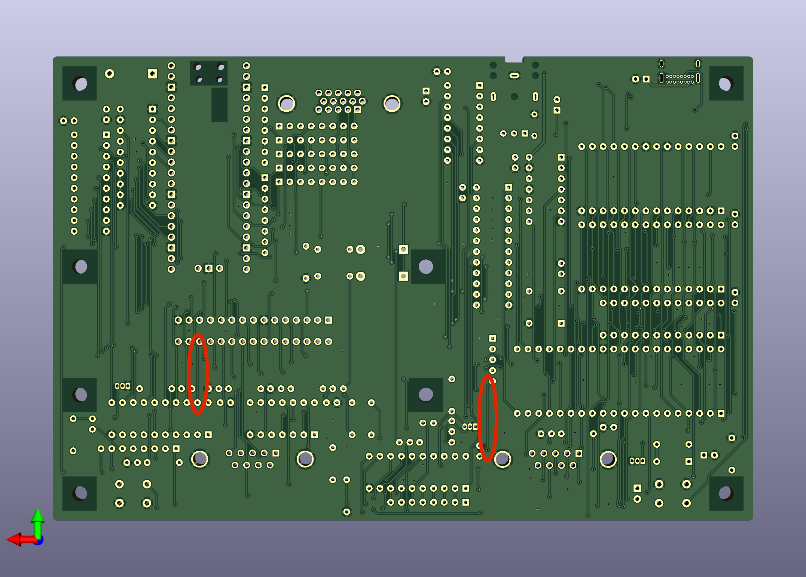
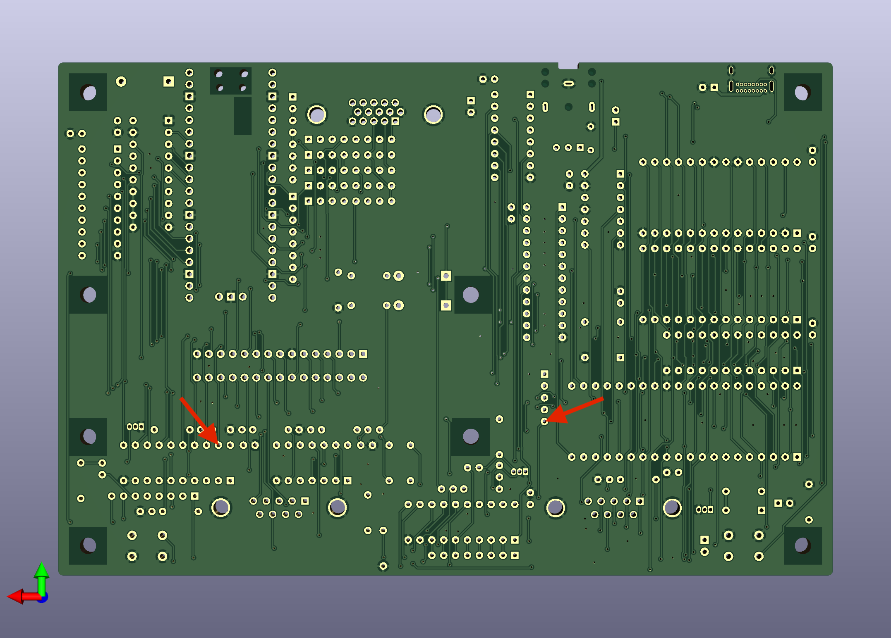
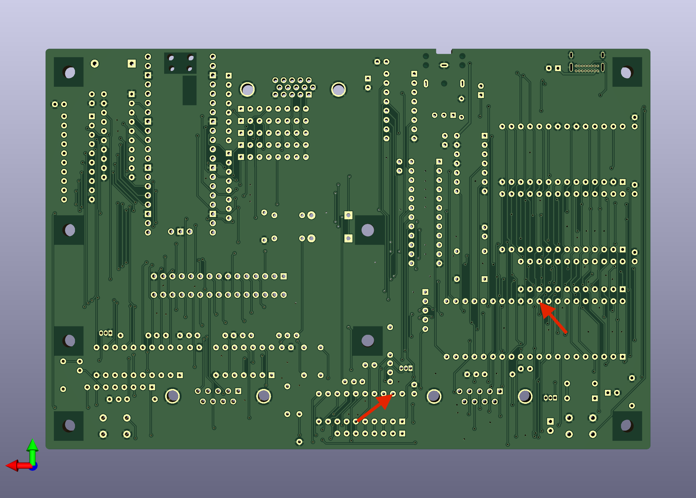

# Rev 0.1 swapped controller fix

This simple 3-step procedure will fix the swapped controller problem that
exists on rev 0.1 boards.

## Step 1

Cut the following two traces on the back side of the board.

## Step 2

Solder a bodge wire to pin 5 of RN101 and pin 19 of U402.  Secure the
wire with Kapton tape.

## Step 3

Solder a bodge wire to pin 19 of U401 and pin 31 of U101.  Secure the
wire with Kapton tape.

