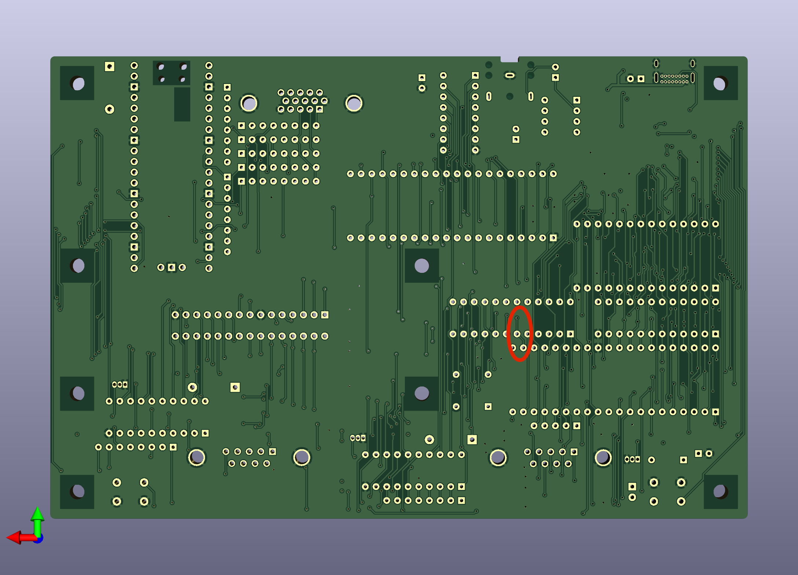
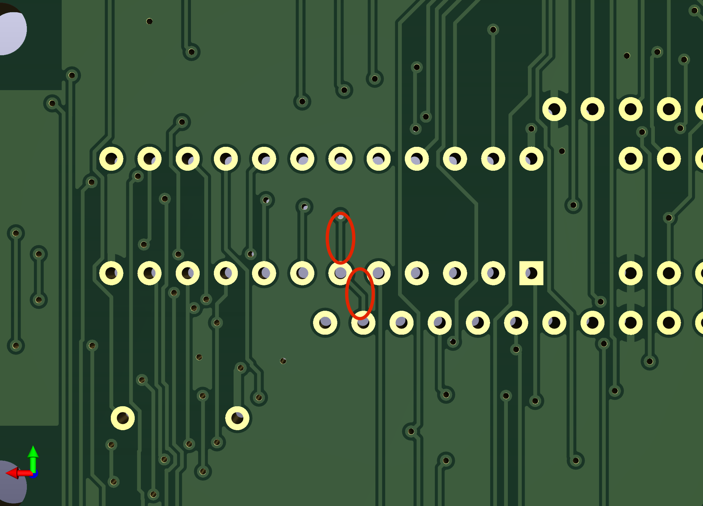
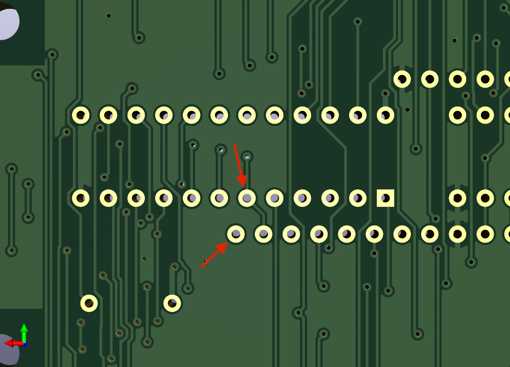
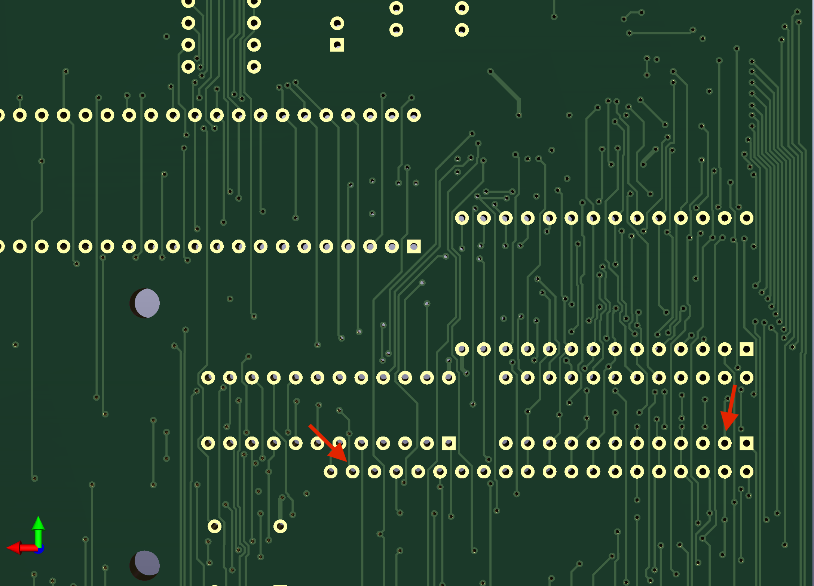
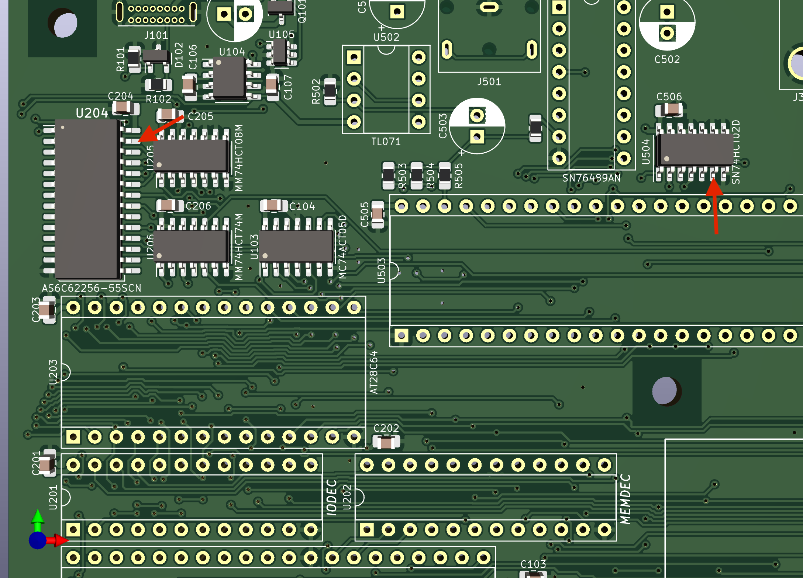

# Rev 2.0 memory address decoder fix

This simple 5-step procedure will fix the memory address decoder issue
that exists on rev 2.0 boards.

## Step 1

Locate the traces on the back side of the board that connects pin 22
of U101 to pin 6 of U202 and then on to a via.

Once located, cut the traces.

## Step 2

Solder a bodge wire to pin 21 of U101 and pin 6 of U202.  Secure the
wire with Kapton tape.

## Step 3

Solder a bodge wire to pin 22 of U101 and pin 2 of U201.  Secure the
wire with Kapton tape.

## Step 4

Flip the board over to work on the front side.  Solder a bodge wire to
the leg of pin 27 of U204 and the leg of pin 6 of U504.  Secure the
wire with Kapton tape.

## Step 5

Remove U202 (the MEMDEC GAL) from the socket.  Re-program the GAL using
[this version](../gal-files/memdec.jed) of the MEMDEC fuse map.  Re-insert
the MEMDEC GAL into the socket.
