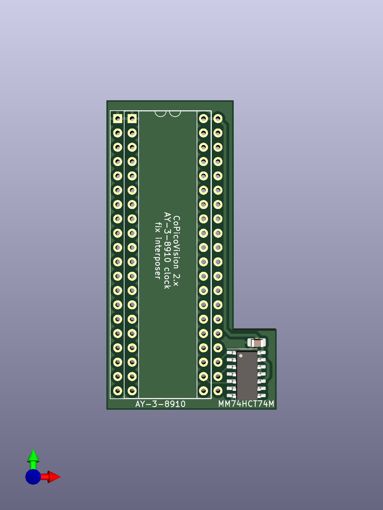

# Rev 2.x AY-3-8910 clock fix interposer board

Rev 2.x of the CoPicoVision provides an incorrect clock frequency to the
AY-3-8910 sound chip.  For these CoPicoVision revisions, an interposer
board is used to provide the correct clock frequency to the AY-3-8910.

Use [these Gerber files](rev2_x_ay_interposer/Gerbers) to order a run
of interposer board PCBs.  In addition to the PCBs, you will need:

* 2 1x20-pin machined pin male headers with 2.54mm spacing.
* 1 standard DIP-40 socket.
* 1 MM74HCT74M (or equivalent) in surface-mount SOIC-14-Narrow package.
* 1 0.1uF ceramic capacitor in surface-mount 0805 package.

On the top of the board is a DIP-40 socket to hold the AY-3-8910.  Offset
just to the right of the socket pins are machine pin headers facing down
that plug into the AY-3-8910 socket (U503) on the CoPicoVision board.

This simple 6-step procedure is the recommended assembly order for the
interposer board.

## Step 1

Solder the 0.1uF ceramic capacitor onto the footprint directly above
the MM74HCT74M.

## Step 2

Solder the MM74HCT74M to its footprint.

## Step 3

Install the 2 1x20 machined pin headers on the bottom side of the board,
facing downwards.  Of each pair of through-hole columns, the headers are
installed on the right pair (when viewed from the top of the board).  These
pin headers must be soldered from the top of the board, so it is crucial
that they are soldered before proceeding to step 4.

## Step 4

Install the DIP-40 socket on the top side of the board and solder it from
the bottom side of the board.

## Step 5

Remove the AY-3-8910 (U503) from its socket on the CoPicoVision and install
it into the socket on the interposer board.

## Step 6

Install the interposer board into the AY-3-8910 (U503) socket on the
CoPicoVision.
